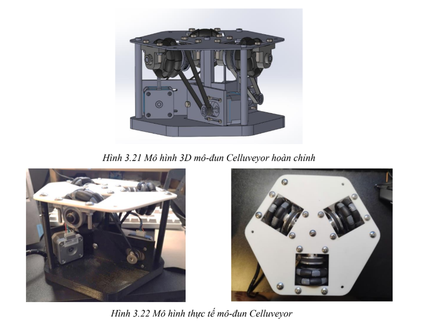
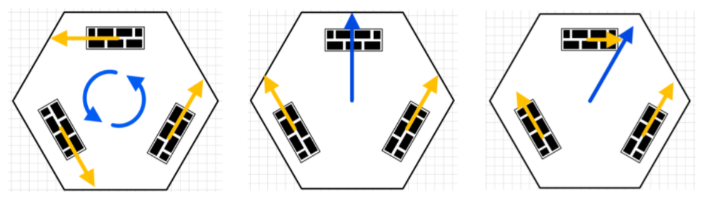

# CELLUVEYOR Robot Controller


*CELLUVEYOR Robot - A modular conveyor system featuring three KV4234 stepper motors for omnidirectional movement*

A Python-based control system for the CELLUVEYOR robot, featuring three KV4234 stepper motors controlled by an Arduino Nano with CNC Shield V3.

## 🔌 Hardware Setup

### Required Components
```
✓ Arduino Nano + CNC Shield V3
✓ 3x KV4234 Stepper Motors
✓ 12V-24V Power Supply
✓ USB Cable
```

### Connection Guide
```
1. Mount Arduino Nano onto CNC Shield V3
2. Connect Motors:
   Motor #1 → X-axis
   Motor #2 → Y-axis
   Motor #3 → Z-axis
3. Connect 12V-24V power to CNC Shield
4. Connect Arduino via USB
```

## 🚀 Quick Start

### 1. Upload Arduino Code
```bash
1. Open run.ino in Arduino IDE
2. Select: Arduino Nano
3. Select: COM Port
4. Click: Upload
```

### 2. Run Python Interface
```bash
# Install dependencies
pip install pyserial keyboard

# Run controller
python control.py
```

## 🎮 Control Commands

### Basic Movement
```
Command  Function                  Example
---------------------------------------
F[n]     Forward n steps          F100
B[n]     Backward n steps         B100
S[n]     Set speed (500-2000)     S800
P        Show position            P
E        Emergency stop           E
Q        Quit program            Q
```

### Speed Settings
```
S500  → Fastest
S1000 → Medium
S2000 → Slowest
```

## 📋 Usage Example

```bash
> python control.py
Celluveyor Controller initialized...

> S1500    # Start with safe speed
Speed set to 1500

> P        # Enable position monitoring
Position - X: 0 Y: 0 Z: 0

> F100     # Move forward 100 steps
Moving forward 100 steps

> B100     # Move backward 100 steps
Moving backward 100 steps

> S800     # Increase speed
Speed set to 800

> E        # Emergency stop
STOPPED

> Q        # Quit program
Program terminated
```

## ⚠️ Important Notes

- Always start with slow speed (S1500)
- Monitor position (P) during movement
- Use emergency stop (E) if needed
- Valid speed range: 500-2000 microseconds
- Lower speed number = Faster movement

## 🛠️ Technical Details


*Motor Control System - Three KV4234 stepper motors arranged at 120° angles for omnidirectional movement*

### Motor Specifications
```
Type: KV4234 NEMA17 Stepper
Steps/Rev: 200 (1.8°/step)
Voltage: 12-24V
Current: 1.5A/phase
```

### Communication
```
Protocol: USB Serial
Baud Rate: 115200
```

### Source Files
```
run.ino    → Arduino firmware
control.py → Python interface
```